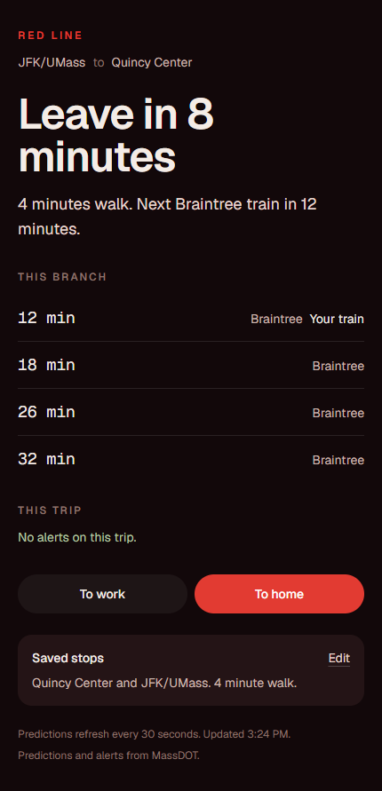

# Red Line

A commute screen for one Red Line trip. You save a home stop, a work stop, and how long it takes to walk to the platform. The page leads with whether you should leave, then the next trains on that branch, and only the alerts that touch that trip.

Live demo: [red-line-sandy.vercel.app](https://red-line-sandy.vercel.app)

  
  

The leave-now decision is covered by tests. Run them with `npm test`.

Saved stops live in a local SQLite database. Live trains and alerts come from the [MBTA V3 API](https://api-v3.mbta.com/docs/swagger/index.html).
